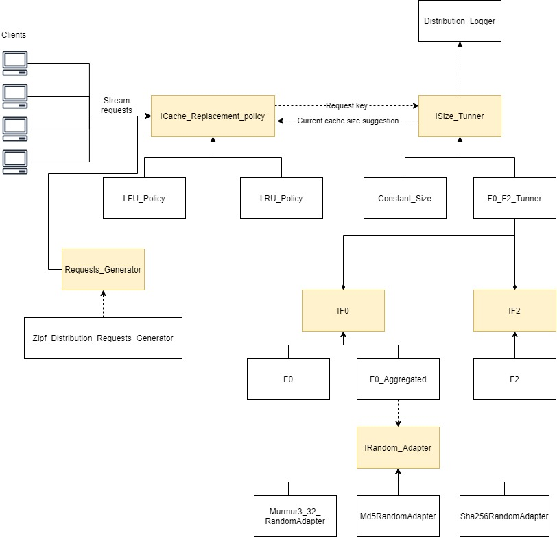

# MomentsCacheAllocator
This project introduce MomentsAllocator, a caching advisor service for a multi-tenant environment.
MomentsAllocator require very few resources in terms of cpu and storage and output each time slot a suggested size of cache to assign to the application.

## Architecture

